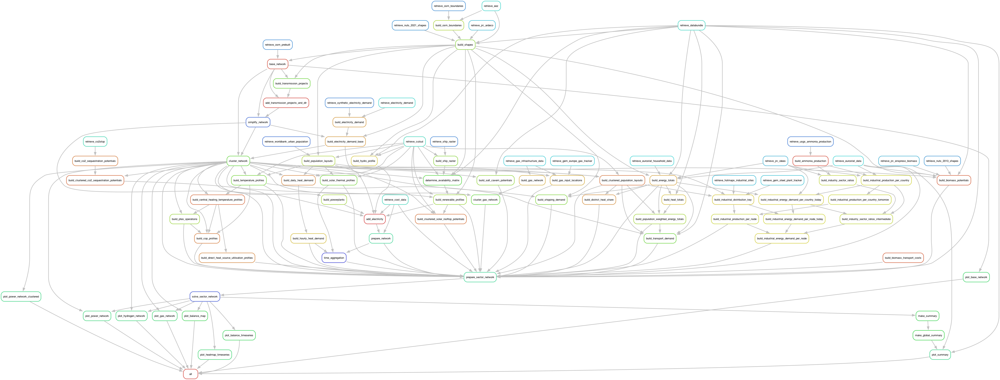

..
  SPDX-FileCopyrightText: Contributors to PyPSA-Eur <https://github.com/pypsa/pypsa-eur>
  SPDX-FileCopyrightText: Contributors to gb-open-market-model <https://github.com/open-energy-transition/gb-open-market-model>

  SPDX-License-Identifier: CC-BY-4.0

##################################################################################
gb-open-market-model: Great Britain dispatch model built on the PyPSA-Eur workflow
##################################################################################

About
=====

gb-open-market-model is an extension of `PyPSA-Eur <../index.html>`_., used to quantify the economic (dis)benefit of proposed transmission boundary reinforcement options within the country.

Workflow
========

.. note::
    The graph above was generated using
    ``snakemake --rulegraph -F | sed -n "/digraph/,/}/p" | dot -Tpng -o workflow.png``

Operating Systems
=================

The gb-open-market-model workflow is continuously tested for Linux, macOS and Windows (WSL only).

.. toctree::
   :hidden:
   :maxdepth: 2
   :caption: Configuration

   configuration
   costs

.. toctree::
   :hidden:
   :maxdepth: 2
   :caption: References

   release_notes
   data_sources
   ../index